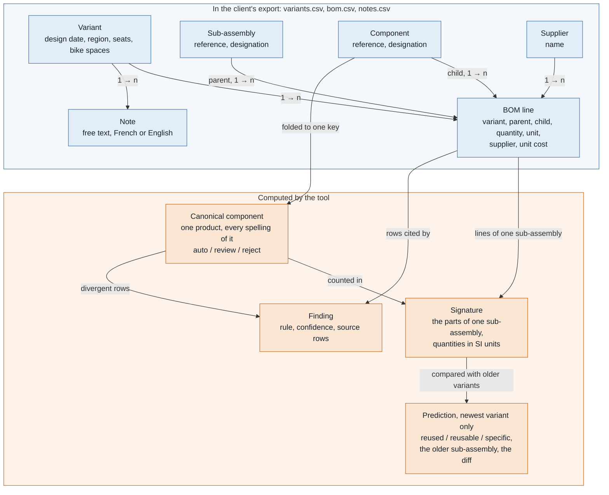
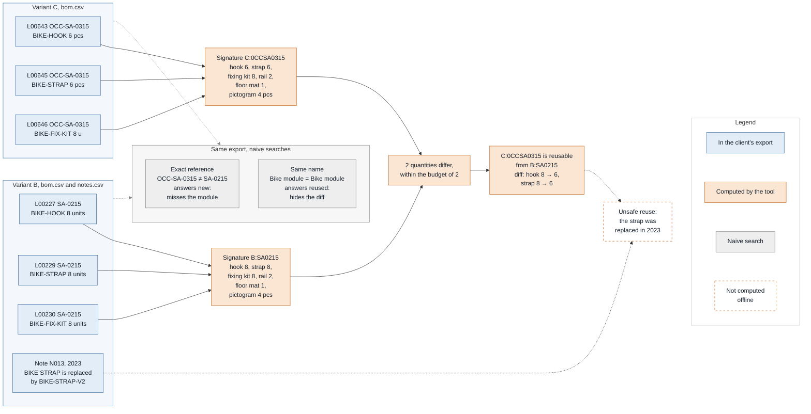

# alstom-bom-reuse

> Status: scouting prototype, complete for the case. Built for the Cognyx FDE case study
> (fictional pilot at Alstom Valenciennes), scoped small on purpose. All data is synthetic.

## The problem

When a new tender comes in, engineers cannot tell which of the sub-assemblies it needs already
exist in past train variants. The data does not let anyone recognize that a part or a
sub-assembly is the same from one variant to the next: duplicated references with typos, mixed
units, free-text notes in French and English that sometimes contradict the Bill of Materials.
So what already exists is re-designed and re-costed.

**The problem this tool solves: for a given variant, identify every sub-assembly that already
exists in the other variants — identical, or reusable with a known diff — and flag the
inconsistencies that would make reuse unsafe.**

## How it answers it

1. **The foundation.** A deduplicated catalogue of sub-assemblies across all existing variants,
   each with where it is used, classified:
   - *reused* — identical across variants;
   - *reusable* — near-identical, with the exact diff;
   - *specific* — used by one variant only;

   plus the list of inconsistencies (duplicate references, unit conflicts, supplier or cost
   conflicts, notes contradicting the BOM). This answers the brief's question: *which
   sub-assemblies are reused — or reusable — across variants, and where are the
   inconsistencies?*
2. **The proof of use (backtest).** The newest variant plays "the new tender". Given only the
   older variants, the tool says which of its sub-assemblies already existed, and is scored
   beside two naive searches on the same data — by exact reference, and by designation. The gap
   between them is the measured value.

| In scope | Out of scope |
| --- | --- |
| Finding what already exists for a given variant, with evidence | Decomposing a new design to make it reusable later (CAD and engineering work, not data) |
| Flagging inconsistencies that make a reuse unsafe | Fixing the data in the PLM: the tool only proposes |
| Measuring how much an exact-reference search misses | Estimating time or money saved: defined with the client |

Primary user: the design engineer preparing a tender.

## The entity model

Blue is what the client's export already holds; orange is what the tool computes from it. The
export is read-only: nothing orange is ever written back.



A BOM line is an n-ary relation — variant, parent, child, quantity, unit — not an attribute of
a component: the same component sits in several variants with different quantities, suppliers
or costs, and that is carried by the line rather than by duplicating the product. Every
normalized value keeps its raw characters beside it (`src/bomreuse/model.py`).

### One sub-assembly, followed through: the bike module of B and of C

B is an older bike car; C is the newest, playing the new tender. Their bike modules, as the tool
reads them (six lines each; the three whose raw lines differ are shown):



- **The references are made comparable before anything is compared.** `units`, `u` and `pcs`
  all become pieces; `BIKE-STRAP` in both variants folds to the key `B1KESTRAP`, so the two lines
  count the same canonical component.
- **The comparison is on content, not on reference.** The sub-assembly was renamed from
  `SA-0215` to `OCC-SA-0315`; its six parts are the same, and two quantities moved. The
  threshold in `data/dataset_spec.toml` allows two differences for a six-part sub-assembly, so
  the verdict is *reusable*, with its diff.
- **The two naive searches fail in opposite directions.** The exact reference finds nothing and
  answers *new*; the designation finds a *reused* that is not one.
- **The dashed box is what the offline run cannot compute.** N013 is written in French, and writes
  the replaced part as `BIKE STRAP` — a space where a hyphen makes a reference, and no digit to
  save it — so the keyword reader finds the French cue (*est remplacé par*, "is replaced by") and
  no reference before it, and extracts nothing (`notes.py`; the shape is listed in **Known
  limits**). Its row in `bomreuse run`'s backtest table therefore prints with no flag. Reading
  this note is what the `--notes llm` backend is for, and the ground truth plants this reuse as
  unsafe — the case the demo talks about.

## What the synthetic data contains, and why

The dataset is designed backwards from the problem: each property exists so that one claim can
be measured.

- 4–6 variants of a regional-train **intermediate car** (standard, bike car, bi-mode, other
  regions), ~100–250 BOM lines each, with a chronology (design date, region, seats, bike
  spaces, traction). Three carry the story: A (standard), B (bike car) and C, the newest — a
  bike car for a new region, playing the "new tender".
- C is a full eBOM, as designed. Its spec (region, seats, bike spaces, date) is variant
  metadata: the tool matches sub-assemblies, not requirements.
- Costs and suppliers per component, with conflicts across variants; ~40 technical notes in
  French and English.
- Hidden reuse: sub-assemblies of the newest variant identical in content to older ones, under
  new or typo'd references.
- Near-reuse: sub-assemblies differing from an older one by 1–3 parts.
- Genuinely new sub-assemblies, so the tool cannot claim that everything already exists.
- Unsafe reuse: a matched older sub-assembly containing a part a note declares obsolete.
- A ground truth, read only by the evaluation, never by the pipeline.

As generated: 5 variants (A, B, D, E and C), 696 BOM lines (135 to 145 per variant) and 40
notes, in three `;`-separated UTF-8 files under `data/raw/` — `variants.csv`, `bom.csv`,
`notes.csv`. `data/dataset_spec.toml` is the contract they are generated from.

## What's in the repository

```
data/raw/                 the input: variants.csv, bom.csv, notes.csv — read, never written
data/ground_truth/        the answer key of the synthetic dataset, read by `evaluate` only
data/dataset_spec.toml    the reuse threshold, and how the synthetic data was built
src/bomreuse/             the code, one module per stage
tests/                    all tests
out/                      created by `run`, absent from a fresh clone: report.html and the JSON artifacts
docs/                     the case brief, the PRD, the architecture

CLAUDE.md, DECISIONS.md, CONTEXT.md, .claude/
                          how this was built: the rules given to the AI agents, the human
                          decisions, the pilot context, the per-issue run procedure
```

The last group is for a reviewer of the build, not for a user of the tool: running it needs
none of those files.

`src/bomreuse/` is flat, but its modules fall into three groups, and a module of one group
never serves another's purpose:

| Group | Modules | Command |
| --- | --- | --- |
| Synthetic data — would not exist on client data | `catalogue`, `dirt`, `generate`, `ground_truth` | `generate` |
| The tool | `ingest`, `normalize`, `resolve`, `rules`, `notes`, `link`, `signatures`, `checks`, `report`, `artifacts` | `run` |
| The measurement | `evaluate` (the only reader of the ground truth), `baseline` (the two naive searches) | `evaluate` |

Shared: `model` (the types, importing nothing from the package), `cli` (the one entry point)
and `spec`, which loads `data/dataset_spec.toml`. The generator reads the whole file; the tool
reads only its two reuse thresholds, so that the planted cases and the classifier use one
definition. `report` also calls `baseline`, to set the tool's answer beside the naive ones.

## How to run

Python 3.12 and [`uv`](https://docs.astral.sh/uv/). From a fresh clone, end to end:

```bash
git clone https://github.com/BluegReeno/alstom-bom-reuse.git && cd alstom-bom-reuse
uv sync                                          # the only step that needs a package index
uv run pytest
uv run bomreuse run --raw data/raw --out out     # the pipeline, offline
uv run bomreuse evaluate --ground-truth data/ground_truth/ground_truth.json
```

Then open `out/report.html` in a browser — one self-contained file, no server, no network.

`uv sync` installs the pinned dependencies of `uv.lock`, which needs a package index or a warm
`uv` cache; **everything after it runs with no network at all**. Checked on a clean clone:
`uv sync --frozen --offline`, then the whole pipeline offline, then `uv run pytest` — 1004 tests
green in under 10 s of the 30 s budget — and an `out/report.html` byte-identical to the one the
working tree produces.

Four commands, one entry point:

| Command | Reads | Writes | When |
| --- | --- | --- | --- |
| `run` | `data/raw/` | `out/` — the report and the JSON artifacts | the one a client is shown |
| `evaluate` | `data/raw/` and the ground truth | nothing: it prints the scores | to measure the value claim |
| `normalize` | `data/raw/` | `out/normalized.json` | to look at the first stage alone |
| `generate` | `data/dataset_spec.toml` | `data/raw/` and the ground truth | to regenerate the synthetic data |

The two the block above does not show:

```bash
uv run bomreuse normalize --raw data/raw --out out
uv run bomreuse generate --out data/raw --ground-truth data/ground_truth/ground_truth.json
```

- Inputs are read-only: `--out` may not be inside `--raw`, for `run` and for `normalize`.
- `normalize` reads the three CSV files exactly as they are and writes `out/normalized.json`,
  where every value keeps its raw characters next to what the tool made of them (line `L00052`:
  `42000` `mm` next to `42.0` `m`). A value it cannot read keeps its row, is stored as `null`
  and is counted as an issue; a file without the expected structure stops the run.
- `generate` takes both paths as required arguments: the ground-truth location is never a
  constant in the code. The seed (`--seed`) moves the dirt — spellings, units, decimal commas —
  never the story: every seed yields the same backtest answers. The committed dataset uses the
  default seed, and a test checks it is byte-identical to a fresh generation.
- `evaluate` is the only command that reads the ground truth, and that path has no default
  (`docs/ARCHITECTURE.md` A5). It re-runs the pipeline rather than reading `out/`, and writes
  nothing. What it prints is **Results**, below.

### What `run` does

The command a client would be shown. It normalizes the raw files, decides which references are
the same component, reads the free-text notes, builds the signature of every sub-assembly and
plays the newest variant as a new tender. It prints the answer as a table and writes
`out/normalized.json`, `out/resolution.json`, `out/note_facts.json`, `out/findings.json`,
`out/signatures.json`, `out/predictions.json` and the report, `out/report.html`. The design
behind each stage is in `docs/ARCHITECTURE.md`; what follows is what each one prints on the
committed dataset.

**References.** Two references become one component when the stated foldings give them the same
key — uppercase, then `O`→`0`, `I`→`1`, `L`→`1`, then non-alphanumerics dropped. **There is no
string-distance matching anywhere**: in a Bill of Materials two references differing by one
character are often genuinely different parts, and a false *reused* is the worst error this
tool can make. Each group the key forms is rated *auto* (the rows agree), *review* (one
component whose rows disagree on designation, unit, supplier or cost — still merged, and a
finding) or *reject* (the designations name different products; the group is split back apart).
The run reports 160 candidate groups resolving to 163 canonical components — 144 *auto*, 13
*review*, 3 *reject* — and 66 findings: 31 from resolution, 13 from the inconsistency checks and
22 from the notes. Every finding names the rule that produced it, the confidence that rule
declares, and the rows of `bom.csv` — or of `notes.csv` — it was read from.

**The backtest.** The signature of a sub-assembly is the multiset of *(canonical component,
normalized quantity, SI unit)* it contains. Given **only the variants designed before it**, each
sub-assembly of the newest variant comes out *reused* (an older signature is identical),
*reusable* (an older signature is within the threshold, and the exact diff is shown) or
*specific* (neither). The threshold is two numbers in `data/dataset_spec.toml`, written before
the data was generated and never tuned against a score. The run reports **8 reused, 5 reusable
and 2 specific** of the newest variant's 15 sub-assemblies, each naming the older sub-assembly
the answer rests on:

```
backtest          C (bike car, new region, designed 2025-02-17) against A, B, D, E
  sub-assembly  designation                     class     from          difference
  C:0CCSA0315   bike module                     reusable  B:SA0215      B1KEH00K 8 pcs -> 6 pcs, B1KESTRAP 8 pcs -> 6 pcs
  C:0CCSA0314   floor and wall anchorage        specific
  C:SA0101      carbody shell                   reused    A:SA0101
```

Those counts are what the tool *finds*; how many are right is `evaluate`'s answer, in
**Results**. A sub-assembly whose lines could not all be read says so on its row; none of the
committed dataset is in that case.

**The inconsistencies.** Each canonical component is checked for rows that disagree on its unit,
its supplier or its unit cost, after normalization: `1000 mm` against `1 m` is agreement. The
part stays merged and stays in the signatures; the disagreement is what a human must settle.
The run reports **13 components whose rows disagree — 3 on unit, 5 on supplier, 5 on cost** —
the same 13 resolution rated *review*. A *reused* or *reusable* row whose parts carry one names
those parts on its row — 9 of the 13 reuse answers:

```
  C:0CCSA0302   trailer bogie                   reused    A:SA0102      [check: B0G1EDAMPER (supplier)]
inconsistencies   13 components whose rows disagree
  unit            3
    'LIGHT-CABLE' (component 11GHTCAB1E) has 2 different unit values: 'm' in A, B, C, D; 'pcs' in E.
```

**The notes.** Each note is read on its own, and only what it *asserts* about a component is
kept: that it has been replaced, that it is obsolete, or that it must not be used on some
configuration. The reference the note writes is matched through the same folding rules as the
BOM, so a note about `Bgi-2031` reaches the component the export spells `BGI-2031`. Where a fact
lands on a component the BOM still carries, that is a note contradicting the BOM: a finding,
with the note's row as evidence, at the lowest confidence of the catalogue, 0.60. By default
this runs with **no network at all**, on an FR/EN keyword lexicon written from the note patterns
of the brief and never from the dataset. It reads **22 facts out of 40 notes — 9 replacements,
7 obsolescences, 6 restrictions — all of them linked to a component**; what a lexicon cannot do
is in **Known limits**. **6 of the 13 reuse answers rest on a part a note speaks against**, and
10 of the 13 carry a flag once the value conflicts above are counted too:

```
  C:SA0105      braking unit                    reused    A:SA0105      [check: BRKH0SEF1EX (supplier), BRKPARK1NGACT (obsolescence)]
notes             40 read by keyword
  facts           22 (22 on a component of the BOM, 0 unresolved)
  unusable output 0
note vs BOM       22 parts a note contradicts the BOM about
  obsolescence    7
    note N005 declares 'WC-GRAB-BAR' obsolete, and the BOM carries component WCGRABBAR on A, B, D, E. Read by keyword.
```

The braking unit is the row the demo is for: the tool says *reused*, and the same row says one
of its parts has been retired by a note — N031, whose finding in `out/findings.json` reads *note
N031 declares 'BRK-PARKING-ACT' obsolete, and the BOM carries component BRKPARK1NGACT on A, B, C,
D, E*.

`--notes llm` reads the notes with one local model instead — `gemma4:12b-mlx` through Ollama on
`localhost`, the on-prem path; `--notes-model` names another. The answer is validated on
arrival: the shape by schema, and every reference it cites must appear verbatim in the note, or
it is rejected, logged and counted. If nothing answers, the run stops and prints the flag that
would have worked. The model is opt-in, never required.

**A manual measurement of the notes layer, labelled as one** (`DECISIONS.md` 6). It was run by
hand on 2026-09-21 from a script that is not part of the build: each reader went over the 40
committed notes, and each fact was scored on its kind and its cited reference against the
notes of `data/ground_truth/ground_truth.json`, which assert 28 facts in 28 notes and nothing in
the other 12. Each figure comes from one run at temperature 0.

| Reader | Right | Invented | Missed | Notes read exactly | Time |
| --- | --- | --- | --- | --- | --- |
| keyword (the default) | 19 | 3 | 9 | 28 / 40 | < 1 s |
| `gemma4:12b-mlx`, local, first prompt | 25 | 15 | 3 | 25 / 40 | 135 s |
| `gemma4:12b-mlx`, local, current prompt | 28 | 0 | 0 | 40 / 40 | 94 s |
| `glm-5.3-flash:cloud`, first prompt | 0 | 0 | 28 | 12 / 40 | 110 s |
| `glm-5.3-flash:cloud`, first prompt + answer shape | 28 | 1 | 0 | 39 / 40 | 137 s |
| `glm-5.3-flash:cloud`, current prompt | 28 | 0 | 0 | 40 / 40 | 80 s |

Read the last rows as a ceiling, not as a result. The current prompt was written **after**
reading the first prompt's errors on these same forty notes: gemma's invented facts on notes
asserting nothing, and the old and new parts swapped on *fit B instead of A*. The notes come from
the hand-written catalogue, not from the seed, so there is no held-out set to score it on. Two
findings do hold. The prompt matters more than the model: once the prompt was fixed, the
on-prem 12B matched the cloud model on these notes. And an Ollama cloud model ignores the
`format` schema, which is why the first prompt got no usable answer from it: the prompt now
spells out the answer's shape itself. A `:cloud` model is relayed through the local Ollama,
so the notes leave the network, which is exactly what the on-prem path exists to avoid.

**The report.** `out/report.html` is the same run as one self-contained page: `string.Template`
and inline CSS, no asset, no script, no network, each asserted by a test. The sponsor's summary
comes first: the three ways of asking *does this sub-assembly already exist* — by content, by
reference, by designation — side by side on the newest variant's 15 sub-assemblies, with the 8
the reference search does not find named one by one. It carries **no time and no money figure**
(`DECISIONS.md` 3) and no score. Under it, for the lead data engineer: every sub-assembly with
its class, its source and its diff, the parts to check flagged on the row by the rule stdout
uses (`checks.flagged_parts`), then every finding grouped by rule with the rows it cites. The
13 components whose rows disagree each produce two findings — which value moved where, and that
the merge held despite it — so the summary counts 13 inconsistencies, not 66.

### On your own files

`run` is not tied to the committed dataset: it reads whatever folder `--raw` names.

1. Put three `;`-separated UTF-8 files in a folder — `variants.csv`, `bom.csv`, `notes.csv` —
   with exactly the header lines of the files in `data/raw/`. Dates are ISO (`2025-02-17`),
   numbers take a decimal comma or a dot, and the units read are `pcs`, `units`, `unit`, `u`, `m`,
   `mm`, `kg` and `g`.
2. `uv run bomreuse run --raw that-folder --out another-folder`.
3. The variant with the latest `design_date` plays the new tender, against the ones designed
   before it. The reuse threshold is read from `--spec`, the committed `data/dataset_spec.toml`
   unless another file is named.

A file without the expected structure stops the run with the file and the row named. Checked by
removing variant C from a copy of `data/raw/`: the run completes, and E, then the newest, is
played against A, B and D.

Two limits. `evaluate` does not apply: it needs a ground truth, and only the synthetic dataset
has one. And a real PLM/ERP export has other columns: mapping it onto these three files is the
connector named in **What's next**.

## Results

The one claim this build makes, measured. `bomreuse evaluate` plays the newest variant as a new
tender and scores the answer against the ground truth — which the pipeline never reads — beside
the two naive searches a sceptic would try first. All three answer the same 15 sub-assemblies,
under the same rule, which the output states on its `a hit` line (DECISIONS.md 25); `specific`
is the prediction that answers the ground truth's `new` (DECISIONS.md 30). Two counts say what
the score rests on: the values `normalize` could not read, and the BOM lines missing from the
signatures. Both are zero here; on a dirtier export the ratios would have to be read against
them.

```bash
uv run bomreuse evaluate --ground-truth data/ground_truth/ground_truth.json
```

```
ground truth      data/ground_truth/ground_truth.json
backtest          C played as the new tender against A, B, D, E
  sub-assemblies  15 (reused 9, reusable 4, new 2), scored on signatures missing 0 BOM lines
  rows            the ground truth's labels; the prediction that answers 'new' is 'specific'
  a hit           the class is right, and the older sub-assembly named is one the ground truth lists
issues            0

tool              signatures over the canonical components, against the variants designed earlier
  reused          precision 8/8       recall 8/9
  reusable        precision 4/5       recall 4/4
  new             precision 2/2       recall 2/2
  correct         14/15

exact reference   the raw reference matches an older variant's, character for character
  reused          precision 4/5       recall 4/9
  reusable        precision 0/0       recall 0/4
  new             precision 2/10      recall 2/2
  correct         6/15

same name         the raw designation matches an older variant's, case and spacing aside
  reused          precision 9/15      recall 9/9
  reusable        precision 0/0       recall 0/4
  new             precision 0/0       recall 0/2
  correct         9/15
```

**Reading it.** The tool answers 14 of the 15 correctly; the exact-reference search 6, the
same-name search 9.

- **Exact reference** is the search the client already has. It recovers 4 of the 9
  sub-assemblies that already existed and misses the other 5 — the ones the newest variant
  renumbered (`OCC-SA-0302`) or typo'd (`SA-O107`). Worse for a tender, it answers "not there"
  10 times and is right twice: 8 sub-assemblies it declares new are sitting in an older variant.
- **Same name** is the first objection a data engineer raises. On this data the designation is a
  near-perfect join key, so it finds every existing sub-assembly (recall 9/9) — and it finds one
  everywhere, including for the 4 that changed and the 2 that are genuinely new. Precision 9/15,
  and nothing at all on the two classes that decide what an engineer actually does: it cannot
  tell *identical* from *changed*, and it would propose reusing a toilet module and a floor
  anchorage that do not exist.
- **The tool** is the only one of the three that answers *reusable* at all, with the exact diff
  on every one of the 4 (4/4), and the only one that finds both genuinely new sub-assemblies
  (2/2) instead of inventing an ancestor for them.
- **Its one miss**: `OCC-SA-0309`, floor and wall panels, is a *reused* sub-assembly reported
  as *reusable*. Variant C spells one of its parts
  `SEAT-FIX-KIT-447` where every other variant writes `SEAT-FIX-KIT-4471`, a dropped character no
  folding rule can reach and no string distance is allowed to guess at. The engineer is still
  pointed at the right older sub-assembly, with a one-part difference to check. Closing that gap
  would mean fuzzy matching, which the tool refuses: see **Known limits**.

No threshold was moved to produce these figures, and there is no regression floor in this build:
`evaluate` prints them and this section quotes them (DECISIONS.md 17, 29).

## Known limits

What this build does not do, and why. Most of these are deliberate; the ones that were cut are
named with what cut them.

- **A reference the folding rules cannot reach stays a second component.** The rules fold case,
  `O`/`I`/`L` and non-alphanumerics, and nothing else (DECISIONS.md 27): a dropped or transposed
  character — `SEAT-FIX-KIT-447` for `SEAT-FIX-KIT-4471`, `BGI-2013` for `BGI-2031` — leaves two
  components where there is one part. That is the one miss of **Results**. Only string-distance
  matching would undo it, and it would also merge references that differ by one character and
  are genuinely different parts (`docs/ARCHITECTURE.md` A2). The dataset plants both families on
  purpose; the shortfall is named here rather than counted (DECISIONS.md 29).
- **A lone separator is always the decimal mark.** `1,500` and `1.500` are both read as `1.5`,
  never as fifteen hundred (DECISIONS.md 24); `1.234,56` is refused as ambiguous rather than
  guessed. No value of the committed dataset is affected; an export that uses a thousands
  separator would be misread without an issue being raised.
- **Two different products behind one key are told apart by their designations only.** Three
  planted pairs share a canonical key by construction — `SEAT-RAIL-I` with `SEAT-RAIL-1`,
  `DOOR-SEAL-O` with `DOOR-SEAL-0`, `HVAC-GRILLE-1L` with `HVAC-GRILLE-11`. All three come out
  `reject` and are split back apart, and a test asserts it. A key collision whose two products
  are described with the same words would be merged, and nothing here would catch it.
- **The keyword fallback reads words, not sentences — and its accuracy is measured only by hand.** It
  fires on a cue phrase near a reference-shaped token, so a note that *asks* whether a part is
  obsolete, or records a replacement that was **refused**, reads exactly like one asserting it;
  and a fact stated in words the lexicon does not hold — "the supplier is stopping production" —
  is missed entirely. Both shapes are pinned by tests rather than patched: a lexicon extended
  until it caught the committed notes would be fitted to the forty notes it is judged on. It
  produces 22 facts from the 40 notes. The build does not score them (`DECISIONS.md` 29); the
  manual measurement above found 19 right, 3 invented and 9 missed. This is the gap the LLM path
  exists to close, and closing it on notes that nobody read while writing the prompt is what the
  pilot should measure.
- **A note's scope is quoted, never interpreted.** *Ne pas utiliser sur les rames 4 caisses* names
  a configuration in prose; the tool reports the restriction against every variant the BOM carries
  the part on, with the sentence as written, and leaves the reading to the human.
- **A reference a note writes in lower case with a space is out of reach.** `bgi 2031` and
  `mars 2024` have the same shape in running text, and the tool would rather miss a reference
  than read a date as one. Hyphenated spellings (`Bgi-2031`) and upper-case ones are read — an
  upper-case one with a space only when digits follow it (`BGI 2031`): `BIKE STRAP`, in note
  N013, is two words to the keyword reader, and the replacement it records is missed.
- **Nested sub-assemblies are out of scope, by design.** The BOM is read as two levels and a
  signature is flat: a sub-assembly containing another one would be compared on its child's
  reference rather than on that child's contents. A real PLM structure nests; lifting this is a
  pilot question.
- **Two known weaknesses of developer-facing code, left alone when the data layer was frozen**
  (DECISIONS.md 29). `generate()` guards its ground-truth path by spelling, not by file
  identity, so a case-insensitive filesystem or a link gets past it (issue #14, won't-do); the
  pipeline's own read-only guard does compare by identity. And in `normalize`, a positive unit
  cost too small for a float is read as `0.0` with no issue raised (issue #18, won't-do). No
  value of the committed dataset is affected by either.
- **What was cut on 2026-09-21, and why** (DECISIONS.md 29, 33). Scoring anything but the three
  reuse classes — resolution as a clustering problem, precision and recall per defect type:
  they measure the dataset generator as much as the tool. A second LLM backend and any benchmark
  of one: the build wires `gemma4:12b-mlx` behind the adapter interface, and a second model is a
  constructor argument. Regression floors: a floor set on a synthetic dataset is a number about
  the dataset. All three are pilot-scale practices.

## What's next

This prototype is never installed at the client: the pilot runs on the Cognyx platform, on the
real PLM/ERP export. What it sets is what the pilot should measure, strongest proof first:

1. **The backtest on a past tender.** The same play as **Results**, on the client's own
   history: given only the variants that existed before the last tender, which of its
   sub-assemblies were re-done although an equivalent existed?
2. **Engineer validation.** The client's engineers review a sample of proposals; their
   acceptance rate is the precision, measured by the client rather than by us.
3. **A live tender, if one is open.** The time to answer "do we already have this?", today and
   with the tool. A bonus, not a commitment.

Between this build and production sit a connector to the real export, a deployment inside the
client's network with the model served locally, human validation of the proposals with a
feedback loop so corrections are not lost, and access control. The measurements cut from this
build (**Known limits**) belong to the pilot.

## How this was built

See `CLAUDE.md` (rules for the AI agents), `DECISIONS.md` (human decisions) and the commit
history.
