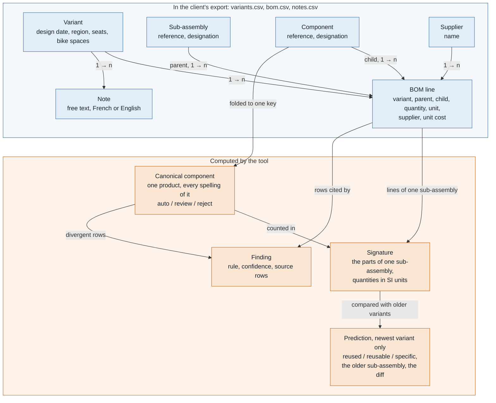

# alstom-bom-reuse

> Status: work in progress. Built for the Cognyx FDE case study (fictional pilot at Alstom
> Valenciennes), scoped small on purpose. All data is synthetic.

## The problem

When a new tender comes in, engineers cannot tell which of the sub-assemblies it needs already
exist in past train variants. The data does not let anyone recognize that a part or a
sub-assembly is the same from one variant to the next: duplicated references with typos, mixed
units, free-text notes in French and English that sometimes contradict the Bill of Materials.
So what already exists is re-designed and re-costed.

**The problem this tool solves: for a given variant, identify every sub-assembly that already
exists in the other variants — identical, or reusable with a known diff — and flag the
inconsistencies that would make reuse unsafe.**

## How it answers it

1. **The foundation.** A deduplicated catalogue of sub-assemblies across all existing variants,
   each with where it is used, classified:
   - *reused* — identical across variants;
   - *reusable* — near-identical, with the exact diff;
   - *specific* — used by one variant only;

   plus the list of inconsistencies (duplicate references, unit conflicts, supplier or cost
   conflicts, notes contradicting the BOM). This answers the brief's question: *which
   sub-assemblies are reused — or reusable — across variants, and where are the
   inconsistencies?*
2. **The proof of use (backtest).** The newest variant plays "the new tender". Given only the
   older variants, the tool says which of its sub-assemblies already existed, and is scored
   beside two naive searches on the same data — by exact reference, and by designation. The gap
   between them is the measured value.

| In scope | Out of scope |
| --- | --- |
| Finding what already exists for a given variant, with evidence | Decomposing a new design to make it reusable later (CAD and engineering work, not data) |
| Flagging inconsistencies that make a reuse unsafe | Fixing the data in the PLM: the tool only proposes |
| Measuring how much an exact-reference search misses | Estimating time or money saved: defined with the client |

Primary user: the design engineer preparing a tender.

## The entity model

Blue is what the client's export already holds; orange is what the tool computes from it. The
export is read-only: nothing orange is ever written back.



A BOM line is an n-ary relation — variant, parent, child, quantity, unit — not an attribute of
a component: the same component sits in several variants with different quantities, suppliers
or costs, and that is carried by the line rather than by duplicating the product. Every
normalized value keeps its raw characters beside it (`src/bomreuse/model.py`).

### One sub-assembly, followed through: the bike module of B and of C

B is an older bike car; C is the newest, playing the new tender. Their bike modules, as the tool
reads them (six lines each; the three whose raw lines differ are shown):


- **The references are made comparable before anything is compared.** `units`, `u` and `pcs`
  all become pieces; `BIKE-STRAP` in both variants folds to the key `B1KESTRAP`, so the two lines
  count the same canonical component.
- **The comparison is on content, not on reference.** The sub-assembly was renamed from
  `SA-0215` to `OCC-SA-0315`; its six parts are the same, and two quantities moved. The
  threshold in `data/dataset_spec.toml` allows two differences for a six-part sub-assembly, so
  the verdict is *reusable*, with its diff.
- **The two naive searches fail in opposite directions.** The exact reference finds nothing and
  answers *new*; the designation finds a *reused* that is not one — the error that costs money.
- **The dashed box is what the offline run cannot compute.** N013 writes the replaced part as
  `BIKE STRAP` — a space where a hyphen makes a reference, and no digit to save it — so the
  keyword reader finds the cue (*est remplacé par*) and no reference before it, and extracts
  nothing (`notes.py`; the shape is listed in **Known limits**). Its row in `bomreuse run`'s
  backtest table therefore prints with no flag. Reading this note is what the `--notes llm`
  backend is for, and the ground truth plants this reuse as unsafe — the case the demo talks
  about.

## What the synthetic data contains, and why

The dataset is designed backwards from the problem: each property exists so that one claim can
be measured.

- 4–6 variants of a regional-train **intermediate car** (standard, bike car, bi-mode, other
  regions), ~100–250 BOM lines each, with a chronology (design date, region, seats, bike
  spaces, traction). Three carry the story: A (standard), B (bike car) and C, the newest — a
  bike car for a new region, playing the "new tender".
- C is a full eBOM, as designed. Its spec (region, seats, bike spaces, date) is variant
  metadata: the tool matches sub-assemblies, not requirements.
- Costs and suppliers per component, with conflicts across variants; ~40 technical notes in
  French and English.
- Hidden reuse: sub-assemblies of the newest variant identical in content to older ones, under
  new or typo'd references.
- Near-reuse: sub-assemblies differing from an older one by 1–3 parts.
- Genuinely new sub-assemblies, so the tool cannot claim that everything already exists.
- Unsafe reuse: a matched older sub-assembly containing a part a note declares obsolete.
- A ground truth, read only by the evaluation, never by the pipeline.

As generated: 5 variants (A, B, D, E and C), 696 BOM lines (135 to 145 per variant) and 40
notes, in three `;`-separated UTF-8 files under `data/raw/` — `variants.csv`, `bom.csv`,
`notes.csv`. `data/dataset_spec.toml` is the contract they are generated from.

## How to run

Python 3.12 and [`uv`](https://docs.astral.sh/uv/). From a fresh clone, end to end:

```bash
git clone <this repository> && cd alstom-bom-reuse
uv sync                                          # the only step that needs a package index
uv run pytest
uv run bomreuse run --raw data/raw --out out     # the pipeline, offline
uv run bomreuse evaluate --ground-truth data/ground_truth/ground_truth.json
```

Then open `out/report.html` in a browser — one self-contained file, no server, no network.

`uv sync` installs the pinned dependencies of `uv.lock`, which needs a package index or a warm
`uv` cache; **everything after it runs with no network at all**. Checked on a clean clone:
`uv sync --frozen --offline`, then the whole pipeline offline, then `uv run pytest` — 999 tests
green in under 10 s of the 30 s budget — and an `out/report.html` byte-identical to the one the
working tree produces.

Regenerate the synthetic dataset (the committed one uses the default seed, and a test checks
that it is byte-identical to a fresh generation):

```bash
uv run bomreuse generate --out data/raw --ground-truth data/ground_truth/ground_truth.json
```

Both paths are required arguments: the ground-truth location is never a constant in the code,
and the pipeline only ever reads `data/raw/`. The seed (`--seed`) moves the dirt — spellings,
units, decimal commas — never the story: every seed yields the same backtest answers.

Read the raw files and write the normalized dataset:

```bash
uv run bomreuse normalize --raw data/raw --out out
```

This is the first stage of the pipeline. It reads the three CSV files exactly as they are —
nothing is stripped or cast on read — and writes `out/normalized.json`, where every value keeps
its raw characters next to what the tool made of them (line `L00052`: `42000` `mm` next to
`42.0` `m`). A value it cannot read keeps its row, is stored as `null`, and is counted as an
issue; a file that does not have the expected structure stops the run. `--out` may not be inside `--raw`: inputs are
read-only. A component here is a *candidate group* — every reference sharing one key — not yet a
resolved component.

Answer the question — the whole pipeline, offline:

```bash
uv run bomreuse run --raw data/raw --out out
```

This is the command a client would be shown. It normalizes the raw files, decides which
references are the same component, reads the free-text notes, builds the signature of every
sub-assembly and plays the newest variant as a new tender; it prints the answer as a table and
writes `out/normalized.json`, `out/resolution.json`, `out/note_facts.json`, `out/findings.json`,
`out/signatures.json`, `out/predictions.json` and the report, `out/report.html`. Same rule on the
paths: `--out` may not be inside `--raw`. It needs no network: the notes are read by the keyword
fallback unless `--notes llm` asks for the model.

Two references become one component when the stated foldings give them the same key —
uppercase, then `O`→`0`, `I`→`1`, `L`→`1`, then non-alphanumerics dropped. **There is no
string-distance matching anywhere**: in a Bill of Materials two references differing by one
character are often genuinely different parts, and a false *reused* is the worst error this
tool can make. Each group the key forms is then rated on its own coherence:

- *auto* — the rows agree; the group is one component;
- *review* — they share a key but disagree on designation, unit, supplier or cost. Still one
  component, and a finding: a part whose supplier or cost moves between variants is the same
  part, and the divergence is what makes a reuse unsafe;
- *reject* — the designations name different products; the group is split back apart.

On the committed dataset the command reports 160 candidate groups resolving to 163 canonical
components — 144 *auto*, 13 *review*, 3 *reject* — and 66 findings: 31 from resolution, 13 from
the inconsistency checks below and 22 from the notes. Every finding names the rule that produced
it, the confidence that rule declares, and the rows of `bom.csv` — or of `notes.csv` — it was
read from.

### The backtest, on stdout

The signature of a sub-assembly is the multiset of *(canonical component, normalized quantity,
SI unit)* it contains, built on every merged group — `auto` and `review` alike, since a part
whose supplier or cost moves between variants is still that part; only a `reject` splits one.
The newest variant then plays the new tender: given **only the variants designed before it**,
each of its sub-assemblies comes out

- *reused* — an older signature is identical;
- *reusable* — an older signature is within the threshold, and the exact diff is shown;
- *specific* — neither.

The threshold is two numbers in `data/dataset_spec.toml`, written before the data was generated
and never tuned against a score; `run` reads them from `--spec`, which defaults to that
committed file. A sub-assembly whose lines the pipeline could not all read carries the count of
them on its row — an answer resting on part of a sub-assembly is not the claim an answer resting
on all of it makes — and no sub-assembly of the committed dataset is in that case. On the
committed dataset the command reports **8 reused, 5 reusable and 2 specific** of the newest
variant's 15 sub-assemblies, each naming the older sub-assembly the answer rests on:

```
backtest          C (bike car, new region, designed 2025-02-17) against A, B, D, E
  sub-assembly  designation                     class     from          difference
  C:0CCSA0315   bike module                     reusable  B:SA0215      B1KEH00K 8 pcs -> 6 pcs, B1KESTRAP 8 pcs -> 6 pcs
  C:0CCSA0314   floor and wall anchorage        specific
  C:SA0101      carbody shell                   reused    A:SA0101
```

Those counts are what the tool *finds*. How many of them are right, and how the two naive
searches do on the same data, is `evaluate`'s answer, in **Results** below.

### The inconsistencies, on stdout

The second half of the question. Each canonical component — the parts of a split group
included — is checked for rows that disagree on its unit, its supplier or its unit cost, after
normalization: `1000 mm` against `1 m`, or `12,50` against `12.50`, is agreement, and there is
no tolerance on cost because the dataset spec declares none. Each disagreement is one finding
saying which variants carry which value. The part stays merged and stays in the signatures: a
part whose supplier moves is still that part, and the disagreement is what a human must settle.

On the committed dataset the checks report **13 components whose rows disagree — 3 on unit, 5 on
supplier, 5 on cost**, printed by type with the first examples, all of them in
`out/findings.json`. They are the same 13 components resolution rated *review*: that finding
says the merge held despite a disagreement, this one says which value moved where. A *reused*
or *reusable* row of the backtest table whose parts carry one of them names those parts on its
row — 9 of the 13 reuse answers on the committed dataset:

```
  C:SA0104      hvac unit                       reused    A:SA0104      [check: HVACF11TER (supplier)]
inconsistencies   13 components whose rows disagree
  unit            3
    'LIGHT-CABLE' (component 11GHTCAB1E) has 2 different unit values: 'm' in A, B, C, D; 'pcs' in E.
```

### The notes, on stdout

The other file the client sent is free text, in French and in English, sometimes both inside one
sentence. The tool reads each note on its own and keeps only what the note *asserts* about a
component: that it has been replaced, that it is obsolete, or that it must not be used on some
configuration. The reference the note writes is kept raw and matched through the same folding
rules as the BOM — one matcher, in one module — so a note about `Bgi-2031` reaches the component
the export spells `BGI-2031`. A fact that reaches no component of the BOM stays in
`out/note_facts.json`, counted, and produces no finding.

Where a fact lands on a component the BOM still carries, that is a note contradicting the BOM,
and it is a finding like the others — with the note's row as evidence, the variants the part is
used on, and the reader that produced it. These findings carry the lowest confidence of the
catalogue, 0.60, because free text is the weakest evidence the tool reads.

By default this runs with **no network at all**, on an FR/EN keyword lexicon written from the
note patterns of the brief — *remplacé par…*, *obsolete since…*, *ne pas utiliser sur…*, *do not
use on 4-car* — and never from the dataset. On the committed dataset it reads **22 facts out of
40 notes — 9 replacements, 7 obsolescences, 6 restrictions — all of them linked to a component**,
and that is what a lexicon can do; what it cannot do is in **Known limits**.

This is where a reuse becomes unsafe, and the backtest table says so on the row rather than in a
block a reader could skip: **6 of the 13 reuse answers rest on a part a note speaks against**,
and 10 of the 13 carry a flag once the value conflicts above are counted too.

```
  C:SA0105      braking unit                    reused    A:SA0105      [check: BRKH0SEF1EX (supplier), BRKPARK1NGACT (obsolescence)]
notes             40 read by keyword
  facts           22 (22 on a component of the BOM, 0 unresolved)
  unusable output 0
note vs BOM       22 parts a note contradicts the BOM about
  obsolescence    7
    note N031 declares 'BRK-PARKING-ACT' obsolete, and the BOM carries component BRKPARK1NGACT on A, B, C, D, E. Read by keyword.
```

The braking unit is the row the demo is for: the tool says *reused*, and the same screen says one
of its parts has been retired by a note. Reuse it as it stands and the tender inherits the
problem.

**Reading them with a model instead.** `--notes llm` sends each note to one local model —
`gemma4:12b-mlx` through Ollama on `localhost`, the on-prem path — and `--notes-model` names
another. The answer is validated on arrival: the shape by schema, and every reference it cites
must appear verbatim in the note, or it is rejected, logged and counted. Nothing else in the
pipeline changes, and if nothing answers the run stops and prints the flag that would have
worked. The model is opt-in, never required: a demo that needs a server running is a demo that
does not run.

### The report, in a browser

`out/report.html` is the same run as one self-contained page, written by `bomreuse run` from the
artifacts it has just written: `string.Template` and inline CSS, no asset, no script, no network.
A test asserts each of those.

The sponsor's summary is the first thing on it: the three ways of asking *does this sub-assembly
already exist* — the content of the sub-assembly part by part, the reference character for
character, the designation — side by side on the newest variant's 15 sub-assemblies, with the 8
the reference search does not find named one by one. It carries **no time and no money figure**
(`DECISIONS.md` 3) and no score: what each search *finds* is a fact about the files, and how many
of those answers are right is `evaluate`'s question, which the page points at rather than
answers.

Under it, what a lead data engineer opens the file for: every sub-assembly of the new tender with
its class, the older one the answer rests on and the exact difference behind every *reusable*;
every disagreement once, with the variants and the values it was read from and the resolution
finding underneath saying the merge held in spite of it; then every finding grouped by the rule
that produced it, with that rule's description, its confidence and the rows of `bom.csv` it cites.
The rule sections are built from the catalogue, so a rule a later issue adds renders itself.

The page counts inconsistencies from the checks and never from the total: the 13 components whose
rows disagree each produce two findings — one saying which value moved where, one saying the merge
held despite it — so **66 findings are not 66 data problems**, and the summary says 13.

### Scoring the answer

```bash
uv run bomreuse evaluate --ground-truth data/ground_truth/ground_truth.json
```

The only command that reads `data/ground_truth/`, and the one path the tool will never default: the
pipeline never sees that file, a static test over every other module enforces it, and a runtime one
runs the pipeline with the real ground truth laid out beside the raw files to show it is not even
opened. `evaluate` re-runs the pipeline rather than reading `out/`, so its figures can never be a
stale artifact's, and it writes nothing. `--raw` and `--spec` default to the committed dataset and
the committed contract. What it prints is **Results**, below.

## Results

The one claim this build makes, measured. `bomreuse evaluate` plays the newest variant as a new
tender and scores the answer against the ground truth — which the pipeline never reads — beside
the two naive searches a sceptic would try first. All three answer the same 15 sub-assemblies,
under the same rule: an answer is right when the class is right **and** the older sub-assembly it
names is one the ground truth lists, any one of them being a valid source to reuse from
(DECISIONS.md 25). Rows carry the ground truth's words; `specific` is the prediction that answers
its `new`, because the tool can only observe that it found no match, never assert that none
exists (DECISIONS.md 30). Two counts say what the score rests on: the values `normalize` could not
read, and the BOM lines missing from the signatures the classes were decided on. Both are zero
here; on a dirtier export they would not be, and the ratios would have to be read against them.

```bash
uv run bomreuse evaluate --ground-truth data/ground_truth/ground_truth.json
```

```
ground truth      data/ground_truth/ground_truth.json
backtest          C played as the new tender against A, B, D, E
  sub-assemblies  15 (reused 9, reusable 4, new 2), scored on signatures missing 0 BOM lines
  rows            the ground truth's labels; the prediction that answers 'new' is 'specific'
  a hit           the class is right, and the older sub-assembly named is one the ground truth lists
issues            0

tool              signatures over the canonical components, against the variants designed earlier
  reused          precision 8/8       recall 8/9
  reusable        precision 4/5       recall 4/4
  new             precision 2/2       recall 2/2
  correct         14/15

exact reference   the raw reference matches an older variant's, character for character
  reused          precision 4/5       recall 4/9
  reusable        precision 0/0       recall 0/4
  new             precision 2/10      recall 2/2
  correct         6/15

same name         the raw designation matches an older variant's, case and spacing aside
  reused          precision 9/15      recall 9/9
  reusable        precision 0/0       recall 0/4
  new             precision 0/0       recall 0/2
  correct         9/15
```

**Reading it.** The tool answers 14 of the 15 correctly; the exact-reference search 6, the
same-name search 9.

- **Exact reference** is the search the client already has. It recovers 4 of the 9
  sub-assemblies that already existed and misses the other 5 — the ones the newest variant
  renumbered (`OCC-SA-0302`) or typo'd (`SA-O107`). Worse for a tender, it answers "not there"
  10 times and is right twice: 8 sub-assemblies it declares new are sitting in an older variant.
- **Same name** is the first objection a data engineer raises. On this data the designation is a
  near-perfect join key, so it finds every existing sub-assembly (recall 9/9) — and it finds one
  everywhere, including for the 4 that changed and the 2 that are genuinely new. Precision 9/15,
  and nothing at all on the two classes that decide what an engineer actually does: it cannot
  tell *identical* from *changed*, and it would propose reusing a toilet module and a floor
  anchorage that do not exist.
- **The tool** is the only one of the three that answers *reusable* at all, with the exact diff
  on every one of the 4 (4/4), and the only one that finds both genuinely new sub-assemblies
  (2/2) instead of inventing an ancestor for them.
- **Its one miss** is honest and worth keeping: `OCC-SA-0309`, floor and wall panels, is a
  *reused* sub-assembly reported as *reusable*. Variant C spells one of its parts
  `SEAT-FIX-KIT-447` where every other variant writes `SEAT-FIX-KIT-4471`, a dropped character no
  folding rule can reach and no string distance is allowed to guess at. The engineer is still
  pointed at the right older sub-assembly, with a one-part difference to check — which is what
  *reusable* means. Closing that gap would mean fuzzy matching, and a false *reused* is the worst
  error this tool can make.

No threshold was moved to produce these figures, and there is no regression floor in this build:
`evaluate` prints them and this section quotes them (DECISIONS.md 17, 29).

## Known limits

What this build does not do, and why. Reasons rather than apologies: most of these are
deliberate, and the ones that were cut are named with what cut them.

- **A reference the folding rules cannot reach stays a second component.** The rules fold case,
  `O`/`I`/`L` and non-alphanumerics, and nothing else (DECISIONS.md 27): a dropped or transposed
  character — `SEAT-FIX-KIT-447` where every other variant writes `SEAT-FIX-KIT-4471` — leaves two
  components where there is one part. That is why one *reused* sub-assembly of the backtest comes
  out *reusable*, described in **Results**. How much resolution misses in total is not measured in
  this build (DECISIONS.md 29); it is the accepted cost of having no string distance anywhere,
  since a false *reused* is the worst error this tool can make.
- **A lone separator is always the decimal mark.** `1,500` and `1.500` are both read as `1.5`,
  never as fifteen hundred: the comma is the decimal mark of the export (DECISIONS.md 24), and
  the dot is read the same way. `1.234,56` is refused as ambiguous rather than guessed, so the
  tool is stricter with two separators than with one. No value of the committed dataset is
  affected; an export that uses a thousands separator would be misread without an issue being
  raised.
- **A transposition or a missing character is out of reach of resolution.** `BGI-2013` for
  `BGI-2031`, or `SEAT-FIX-KIT-447` for `SEAT-FIX-KIT-4471`, stay two components: no folding
  rule undoes them, and only string-distance matching would. That would also merge references
  that differ by one character and are genuinely different parts — the three `must_not_merge`
  pairs of `data/dataset_spec.toml` are exactly that case, and a false *reused* is the worst
  error this tool can make (`docs/ARCHITECTURE.md` A2). So the cost is accepted: the dataset
  plants both families on purpose, and since resolution scoring was cut on 2026-09-21
  (`DECISIONS.md` 29) the shortfall is named here rather than counted.
- **Two different products behind one key are told apart by their designations only.** The
  folding order of DECISIONS.md 27 makes three planted pairs of `data/dataset_spec.toml` share a
  canonical key by construction — `SEAT-RAIL-I` with `SEAT-RAIL-1`, `DOOR-SEAL-O` with
  `DOOR-SEAL-0`, `HVAC-GRILLE-1L` with `HVAC-GRILLE-11`. All three come out `reject` and are split
  back into two components each (the `reject 3` of `run`'s summary), because their designations
  name different products; a test asserts it. The rule reads nothing but those words, so a key
  collision whose two products are described with the same words would be merged and nothing here
  would catch it.
- **The keyword fallback reads words, not sentences — and its accuracy is not measured.** It
  fires on a cue phrase near a reference-shaped token, so a note that *asks* whether a part is
  obsolete, or records a replacement that was **refused**, reads exactly like one asserting it;
  and a fact stated in words the lexicon does not hold — "the supplier is stopping production" —
  is missed entirely. Both shapes are pinned by tests rather than patched: extending the lexicon
  until it caught the committed notes would fit it to the forty notes it is supposed to be judged
  on, and it would measure nothing. On the committed dataset it produces facts from 22 of the 40
  notes; how many of those are right, and how many of the other 18 assert something it missed, is
  **not measured in this build** — extraction scoring was cut with the refocus (`DECISIONS.md` 29).
  This is the gap the LLM path exists to close, and closing it is what the pilot should measure.
- **A note's scope is quoted, never interpreted.** *Ne pas utiliser sur les rames 4 caisses* names
  a configuration in prose; the tool reports the restriction against every variant the BOM carries
  the part on, with the sentence as written, and leaves the reading to the human. Mapping free-text
  scopes onto variants would be inference dressed as a check.
- **A reference a note writes in lower case with a space is out of reach.** `bgi 2031` and
  `mars 2024` have the same shape in running text, and the tool would rather miss a reference
  than read a date as one. Hyphenated spellings (`Bgi-2031`) and upper-case ones are read — an
  upper-case one with a space only when digits follow it (`BGI 2031`): `BIKE STRAP`, in note
  N013, is two words to the keyword reader, and the replacement it records is missed.
- **Nested sub-assemblies are out of scope, by design.** The BOM is read as two levels — variant,
  sub-assembly, component ([A1]) — and a signature is flat: the sub-assembly is the unit of reuse
  and the unit of comparison. A real PLM structure nests, and a sub-assembly containing another
  one would be compared on its child's reference rather than on that child's contents. Lifting it
  is a pilot question, not a prototype one.
- **The generator's ground-truth-inside-raw guard compares by spelling, not by identity.**
  `generate()` refuses a `--ground-truth` path inside `--out` with
  `Path.resolve().is_relative_to(...)` — the string comparison `bomreuse normalize` used until it
  was replaced by an identity check. On a case-insensitive filesystem (macOS, where this is
  developed) `--out t/raw --ground-truth t/RAW/gt.json` gets past it, and so does a symlink or a
  hard link already sitting at the destination. It guards a developer-facing command, and the data
  layer was frozen on 2026-09-21 (DECISIONS.md 29): issue #14 is closed won't-do and the weakness
  is named here instead. The pipeline's own read-only guard, `cli._writes_into`, does compare by
  identity (device and inode), and its bypasses have tests.
- **A cost too small for a float is read as zero.** In `normalize`, a positive `unit_cost_eur`
  whose value underflows a float becomes `0.0` with no issue raised, where the string `"0"` is
  refused. Reaching it takes a cost written with some four hundred leading zeros, so no value of
  the committed dataset is affected and no realistic export carries one. The same underflow on
  quantities is caught and counted (#13); the cost path was left alone when the refocus of
  2026-09-21 froze the data layer (DECISIONS.md 29, issue #18, closed won't-do).
- **What was cut from the build, and why.**
  - *Scoring anything but the three reuse classes.* `evaluate` scores the backtest and stops
    there. Resolution as a clustering problem, and precision and recall per defect type, were cut
    on 2026-09-21 (DECISIONS.md 29): they measure the dataset generator as much as they measure
    the tool, and the one value claim does not rest on them. The cost is the first two bullets of
    this list: how much resolution misses is described there rather than counted.
  - *A second LLM backend, and any benchmark of one.* DECISIONS.md 5 and 6 planned a cloud model
    against a local one on the same task; DECISIONS.md 29 cut the comparison. What the build wires
    is one backend — `gemma4:12b-mlx`, the on-prem path, which runs on a 16 GB laptop — behind the
    adapter interface, plus the FR/EN keyword fallback that is what makes the offline run possible.
    The second model is a constructor argument, not a rewrite. No backend scoring, no latency
    table, no `docs/measurements/`. If both are ever run by hand, their figures belong here,
    labelled as a manual measurement.
  - *Regression floors.* There are none (DECISIONS.md 33): `evaluate` prints its figures and
    **Results** quotes them. A floor that a scouting prototype's synthetic dataset would set is a
    number about the dataset, and holding a build to it is a pilot-scale practice.

## How this was built

See `CLAUDE.md` (rules for the AI agents), `DECISIONS.md` (human decisions) and the commit
history.
